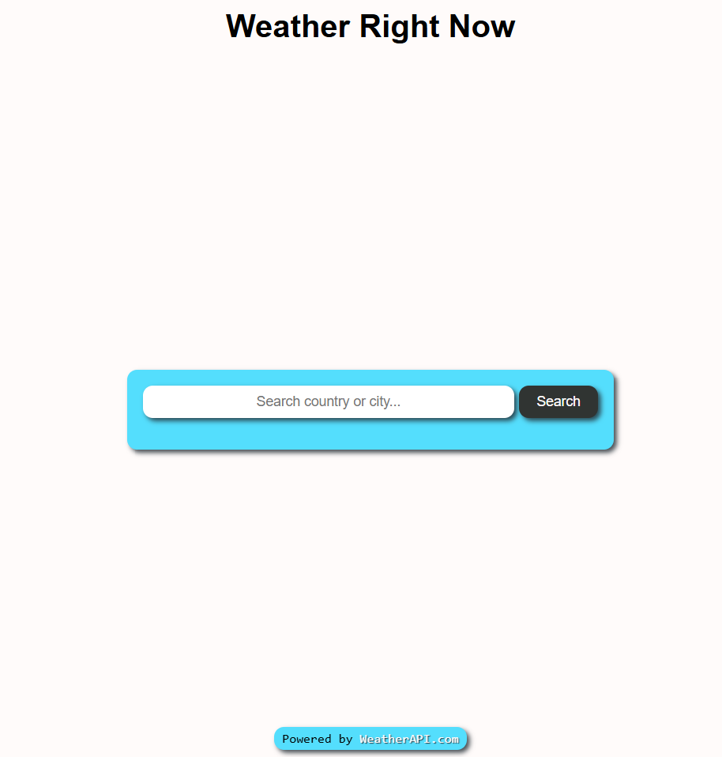

# JavaScript Practice (Weather App)

## API Practice

### Fetching data from [Weather API](https://weatherapi.com)

## Preview

## Details

### Place your own API key inside script.js to use

- Displaying data served from [Weather API](https://weatherapi.com)
- The page background color depends on the searched country/city time (light when day time, dark when night time)

## To-Do

- Adding autocomplete feature from WeatherAPI
- Adding Air Quality data
